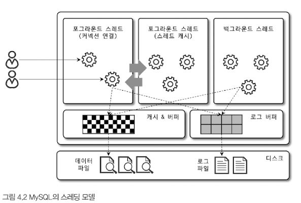
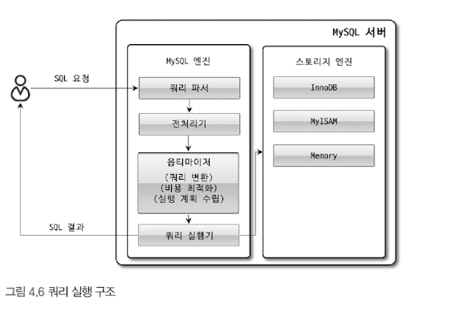
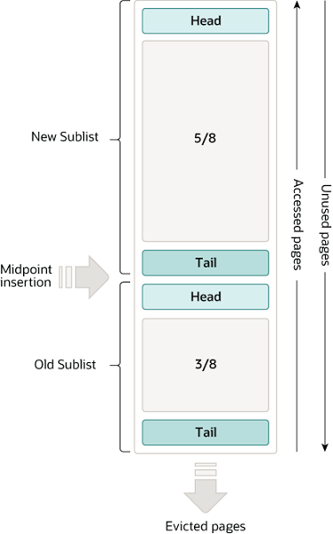

# MySQL 엔진과 스토리지 엔진
MySQL 서버는 크게 MySQL 엔진과 스토리지 엔진으로 구분할 수 있다.

- 스토리지 엔진은 MySQL 하단에 위치하며 하드웨어와 밀접하게 통신하여 mysql 서버를 통해 전달된 유저의 데이터 읽기/쓰기 요청을 처리한다.
- 스토리지 엔진에는 다양한 종류가 있지만, 그 중 InnoDB를 표준처럼 사용한다.

- MySQL 서버는 크게 1) 커넥션 핸들러 2) SQL 파서 3) SQL 옵티마이저 4) 캐시 & 버퍼로 이루어져 있으며, MySQL의 중추적인 부분을 담당한다. (대신 데이터 저장 방식에는 관여하지 않는다.)
- MySQL 서버와 스토리지 엔진 간의 통신은 **핸들러 API**를 통해 이뤄진다.

# MySQL 스레딩 구조

MySQL 서버는 스레드 기반으로 구현되어 있으며, Foreground 쓰레드와 Background 쓰레드로 구분된다.

### Foreground Thread
- 각 Foreground 쓰레드는 각 클라이언트가 요청하는 쿼리를 전담한다. (-> 최소한 현재 MySQL 서버에 접속한 클라이언트 수보다 많다)
- 유저가 커넥션을 종료하면, 쓰레드는 사라지지 않고 쓰레드 캐시로 간다. 이미 쓰레드 캐시에 충분한 쓰레드가 확보되어 있다면 비로소 종료된다.
- 데이터를 MySQL 데이터 버퍼나 캐시로부터 가져온다. 가져올 수 없다면, 핸들러 API를 통해 스토리지 엔진에 요청한다.

### Background Thread
책에서 나열한 Background 쓰레드의 역할은 다음과 같다.
- **Insert Buffer를 병합하는 쓰레드**: Non-clustered 인덱스의 비동기 Insert 작업을 최적화하기 위해, Insert Buffer 버퍼 데이터를 주기적으로 Clustered Index와 병합
- **로그를 디스크로 기록하는 쓰레드**: 트랜잭션 로그를 안전하게 디스크에 지속적으로 기록
- **InnoDB 버퍼 풀의 데이터를 디스크에 기록하는 쓰레드**: 변경된 데이터를 메모리 상의 버퍼 풀에서 디스크로 주기적으로 저장 
- **데이터를 버퍼로 읽어 오는 쓰레드**: 디스크에서 데이터를 버퍼 풀로 데이터를 읽어옴  
- **잠금이나 데드락을 모니터링하는 쓰레드**: DB Lock이나 Deadlock 상황을 감지하고 관리

읽는 작업의 대부분은 Foreground 쓰레드 내부적으로도 처리되는 경우가 많아 굳이 많은 Background 쓰레드를 할당할 필요는 없다.

쓰기 작업의 경우 읽기보다 복잡하게 동작하며, Background 쓰레드에서 대부분의 작업이 처리되기에 충분한 수가 필요하다.

### 메모리 할당 및 사용 구조
MySQL 서버가 사용하는 메모리 공간은 글로벌 메모리 영역과 로컬 메모리 영역으로 나뉜다.

### 글로벌 메모리 영역
클라이언트 수와 무관하게 할당되는 메모리 공간. (2개 이상 일 수도 있지만, 클라이언트 스레드 수와 무관)

교재에서 소개하는 글로벌 메모리 영역은 다음과 같다.

- **테이블 캐시**: 오픈된 테이블의 메타데이터를 메모리에 캐싱하여 테이블을 열거나 접근하는 시간을 줄여준다.
- **InnoDB 버퍼 풀**: 데이터와 인덱스 페이지를 메모리에 캐싱하여 중복된 디스크 I/O를 줄이고 데이터 접근 속도를 빠르게 해준다.
- **InnoDB 어댑티브 해시 인덱스**: InnoDB가 자주 접근하는 데이터에 대해 내부적으로 생성하는 인덱스로 데이터 검색 속도를 빠르게하여 성능을 개선해준다.
- **InnoDB 리두 로그 버퍼**: 트랜젝션 로그를 메모리에 일시적으로 저장하여 데이터베이스의 안정성과 복구를 지원한다.

### 로컬 메모리 영역
- 세션 메모리 영역이라고도 불린다. 이름에서 알 수 있듯 클라이언트 커넥션 마다 할당되는 메모리 영역이자, 클라이언트 쓰레드가 사용하는 메모리 영역이다.
- 클라이언트 쓰레드 간에 절대 공유되지 않는다는 특징을 갖는다.
- 각 쿼리 실행 시에만 공간이 할당되고, 필요하지 않다면 할당이 일어나지 않을 수 있다.

교재에서 소개하는 로컬 메모리 영역은 다음과 같다.

- **Sort 버퍼**: 쿼리 결과의 정렬 과정에서 사용되며, 정렬해야 하는 데이터를 임시로 저장하는데 사용된다.
- **Join 버퍼**: Join 버퍼는 JOIN 연산을 수행할 때 사용되며, JOIN에 참여하는 테이블의 행을 임시로 저장하는 데 사용된다.
- **binlog 캐시**: Binlog 캐시는 바이너리 로그를 작성하는 과정에서 사용되며, 트랜잭션의 변경 사항을 임시로 저장하는 데 사용된다.
- **네트워크 버퍼**: 클라이언트와 서버 간의 데이터 전송에 사용되며, 네트워크를 통해 전송되는 데이터를 임시로 저장하는 데 사용된다.

### 플러그인 스토리지 엔진

- 플러그인 스토리지 엔진 모델은 사용자가 정의한 스토리지 엔진을 통해, 데이터를 읽고 저장하는 방식을 다르게 가져갈 수 있다.

- 이러한 구조 덕분에 스토리지 엔진은  MySQL 엔진과 떨어져 있으며, 앞서 소개한 핸들러 API가 스토리지 엔진과 MySQL 서버를 연결한다.

- 어떤 스토리지 엔진을 사용하더라도 MySQL 엔진에서 내려보내는 내용은 거의 동일하다. 이렇게 내려온 요청은 각 스토리지 엔진에 따라 읽기/쓰기를 다르게 하여 디스크에 저장한다.

- 스토리지 엔진 뿐만 아니라, MySQL과 관련된 다양한 플러그인이 존재하여, 핵심 기능을 확장할 수 있다.

### 컴포넌트
플러그인의 단점을 보완하기 위해 8.0부터 지원되는 아키텍처

# 쿼리 실행 구조

- Query Parser: 클라이언트 요청으로 들어온 쿼리를 토큰으로 분리하여 트리 구조로 재배치
-> 문법 오류가 여기서 잡힘

- Preprocessor: 트리를 기반으로 구조적인 문제점이 있는지 확인. 각 토큰에 실제 테이블 이름과 칼럼, 함수와 같은 개체를 매핑한다.
-> 실제 존재하지 않는 개체이거나 권한이 제한되어 있다면, 여기서 잡힌다.

- Optimizer: 사용자의 요청으로 들어온 쿼리를 가장 저렴한 비용으로 가장 빠르게 처리할 수 있도록 실행 계획을 세우는 단계

- 실행 엔진: 실행 계획에 따라 실제 작업을 수행
    - 그렇지만 실제로 데어터를 꺼내오고 저장하는 건 스토리지 엔진.
    - 핸들러를 통해 스토리지 엔진에게 명령하고 결과를 받아서, 상위 레이어에 다시 반환해주는 역할 (사용자/다른 모듈)

- 핸들러: 실행 엔진이 스토리지 엔진에게 요청하는 단위

# 쿼리 캐시

8.0에서 depreciated된 옵션.

자세한 내용은 DeepDive 참고

# 쓰레드 풀

- 쓰레드 개수 최적화: 서버가 처리해야 하는 사용자 요청 수에 비해 상대적으로 적은 수의 쓰레드 유지
- 효율적인 자원 관리: 쓰레드 풀을 사용함으로써, 요청마다 별도의 쓰레드를 생성하고 파괴하는 오버헤드 감소
- 컨텍스트 스위칭 감소: 제한된 쓰레드만 사용함으로서 컨텍스트 스위칭에 필요한 비용이 상대적으로 감소
- Process Affinity: 특정 프로세스가 특정 CPU 코어에 묶이는 현상을 최적화

# 시스템 테이블
MySQL 서버의 내부 작동과 관련된 정보를 저장. MySQL 서버의 구성, 상태, 사용자 권한 등 다양한 정보를 포함.

1. **mysql.user**:
MySQL 서버에 접근 가능한 사용자와 그들의 권한을 저장. 사용자 이름, 암호, 각종 권한(예: SELECT, INSERT, UPDATE)과 관련된 정보가 포함.

2. **mysql.db**:
데이터베이스 수준에서의 사용자 권한을 저장. 특정 데이터베이스에 대한 사용자의 접근 권한을 정의.

3. **mysql.tables_priv**:
테이블 수준에서의 사용자 권한을 저장. 사용자가 특정 테이블에 대해 어떤 작업을 수행할 수 있는지에 대한 정보를 정의.

4. **mysql.proc**
sp(stored procedure)에 대한 정보를 저장. 각 프로시저의 이름, 유형, 매개변수, 함수 본문을 저장.

5. **information_schema**

이 데이터베이스는 데이터베이스 스키마에 대한 메타데이터를 포함. 테이블, 컬럼, 인덱스 등에 관한 정보를 조회할 수 있음.

6. **performance_schema**

MySQL 서버의 성능과 관련된 데이터를 수집. 쿼리 성능, 락 대기 시간, I/O 사용량 등 다양한 성능 지표를 모니터링하는 데 사용.

# InnoDB

### 프라이머리 키에 의한 클러스터링
- 세컨더리 인덱스(= Non-clustered 인덱스)를 생성하면, 프라미어리 키(= Clustered 인덱스)의 값을 논리적인 주소로 사용
- 실행 계획 상 비중이 높게 설정

### FK 지원
- FK 생성 시 부모와 자식 테이블 모두에 인덱스 생성이 요구
- 데이터 변경 시에 두 테이블 모두에 락을 걸어서, 부모와 자식 테이블에 데이터가 있는지 체크하는 것 필요 <- 데드락 발생의 주요 원인 중 하나

### MVCC

1. 다중 버전 관리: 
- 데이터의 여러 버전을 유지하으로써 여러 트랜잭션이 동시에 데이터를 읽고 쓸 수 있도록 함.
- 각 트랜잭션은 데이터의 특정 "시점"에 해당하는 스냅샷을 보게 되고, 이는 데이터의 일관성을 유지하면서 동시성 향상의 결과를 가져옴

2. 읽기 시의 잠금 불필요
- 읽기 작업 시(SELECT)에는 잠금이 필요하지 않음. 읽기는 시작 시점의 스냅샷을 읽어내면 됌. (SERIALIZABLE 이하)
- SELECT 쿼리는 일관성 있게 트랜잭션 시작 시의 스냅샷을 읽어냄. 트랜잭션 시작 시점 이후 변경이 있더라도 읽기에는 반영되지 않음.

3. 쓰기 작업의 처리
- 쓰기 작업(Insert, Update, Delete) 시에는 데이터의 새로운 버전 생성. 생성된 버전들은 Undo 로그에 저장.
- Read Committed보다 높은 수준의 격리에서 활용 가능

### 버퍼 풀
버퍼풀이란 InnoDB에서 액세스되는 테이블 및 인덱스 데이터를 캐시하는 메모리 영역을 의미
	- 자주 사용하는 데이터를 직접 액세스 가능 (최대 80% 정도 할당)
	- 여러 행을 페이지로 쪼개고, 이를 다시 Linked List 형태로 구현 (LRU 기반 알고리즘)

- 버퍼풀 LRU 알고리즘
	- 새 페이지 추가에 공간이 필요하면, 가장 오래전에 사용된(least recent) 페이지가 제거되고 새로운 페이지는 리스트의 중간에 추가
	- 전체 리스트는 하위 리스트 2개로 취급 (새로운 페이지가 중간에 삽입)

- Head에는 최근에 접근된 새로운 페이지들의 하위 리스트가 있고
- Tail에는 가장 오래전에 접근된 페이지들의 하위 리스트가 있다

계속 접근이 되는 페이지 -> new sublist
덜 접근 되는 페이지 -> old sublist (eviction의 대상)

- 버퍼 풀의 3/8은 항상 old sublist로 할당
- 중간 지점(mid point)은 new sublist의 tail 과 old sublist의 head가 만나는 지점
- InnoDB가 페이지를 버퍼풀에 읽으면 중간 지점에 삽입
- 페이지가 버퍼풀에 의해 읽히는 이유
	- 사용자 초기 작업: 사용자가 실행한 SQL 쿼리와 같은 작업으로 인해 특정 페이지가 필요하면, InnoDB 해당 페이지를 디스크로부터 읽어 버퍼 풀에 삽입
	- Read Ahead: InnoDB는 자동으로 Read-Ahead 작업을 수행하여, 필요한 것으로 예상되는 페이지들을 미리 읽어들인다.
- old sublist에 있는 페이지에 접근한 경우
	- new sublist로 승격 (user-initilzed의 경우 첫 접근 시 / read-ahead에 의한 경우 첫 접근 시 일어나지 않고, 아예 일어나지 않을 수 있음)
- 접근하지 않은 버퍼 풀의 페이지는 목록의 뒤로 이동하여 '노화' -> 페이지가 점점 old sublist의 꼬리로 이동한다.
- 쿼리에 의해 읽혀진 페이지는 기본적으로 바로 new sublist로 이동
	- 해당 페이지가 버퍼풀에 오래 남아있을 수 있도록
	- mysqldump나 where이 없는 select는 많은 양의 데이터를 가져오므로, 버퍼풀 데이터를 대규모로 제거할 수 있다. 특히 새로운 데이터가 다시 사용되지 않는 경우 문제가 될 수 있다.
- Read ahead에 의해 로드된 페이지들도 한 번만 접근되더라도 새로운 하위 리스트의 맨 앞으로 이동
	- 자주 사용되지 않는 페이지들이 오래된 하위 리스트로 밀려나게 하여 제거될 가능성을 높임
- 버퍼 풀 스캔 저항성 및 Read-ahead 구성 최적화를 통해 위와 같은 상황 방지 가능
- 필요한 데이터가 자주 접근되었다면 해당 페이지의 인덱스 키를 Adaptive Hash 인덱스에 추가

*Clean page*: 디스크에서 읽은 이후 전혀 변경되지 않음
*Dirty page*: 디스크에서 읽은 이후 변경된 데이터 페이지 

### Flush 종류

**Flush List Flush**:

더티 페이지를 디스크에 기록하는 가장 일반적인 방법.
InnoDB는 '체크포인트(checkpoint)'라고 하는 특정 시점을 기준으로 더티 페이지를 디스크에 기록한다. 이후 로그 시퀀스 넘버(Log Sequence Number, LSN)에 의해 Flush 여부를 결정한다.

체크 포인트에 도달하면, Dirty Page를 디스크에 Flush하여, 해당 페이지를 Clean Page로 만든다.

**LRU Flush**:

LRU Flush는 버퍼 풀에서의 공간이 부족할 때 발생하는 또 다른 Page Flush.
버퍼 풀에서 새로운 페이지를 로드해야 할 필요가 있고 충분한 공간이 없을 경우, LRU 알고리즘에 따라 선택된 오래된 페이지 중 더티 페이지가 있다면 이를 먼저 디스크에 플러시하고, 그 공간을 비워 새로운 페이지를 로드한다.

### Double Write Buffer

- 데이터를 디스크에 기록하기 전, 일반 데이터 파일과 Double Write Buffer 영역에 각각 기록
- 시스템 충돌로 읹해 페이지가 부분적으로만 쓰여진 경우, Double Write Buffer는 데이터의 완전한 복사본을 보유하고 있기 때문에, 원본 데이터페이지가 손상된 경우에도 복구가 가능.

동작 방식
- 버퍼 풀에서 Dirty Page가 디스크에 기록될 때, 페이지는 먼저 Double Write Buffer로 쓰여진다.
- 이후 버퍼 풀에서 실제 테이블 스페이스 파일로 Dirty Page가 다시 쓰여진다.
- 쓰기 작업이 실패하는 경우 Double Write Buffer의 데이터를 사용하여 원래의 페이지를 복구한다.

### Undo 로그
- 데이터의 변경 작업이 발생하는 경우, 해당 변경 사항 이저느이 데이터 상태를 기록
- READ COMMITTED와 REPEATABLE READ에서 유효
- Undo 로그들이 저장되는 공간을 Undo Tablespace라고 한다.
- Rollback segment라는 구조로 저장. 동시에 여러 Undo 로그가 여기에 저장됌
- 5.5 이상에서는 한 번 늘어난 Undo 로그의 크기는 줄어 들지 않았다. 이후 버전에서는 개선되었다.

### Change Buffer
InnoDB가 Non-Clustered Index에 대한 변경 작업(Insert, DELETE, UPDATE)이 발생하는 경우, Change Buffer에 먼저 저장.

Insert나 Change 작업을 즉시 디스크에 기록하는 대신, 이를 모아서 한꺼번에 효율적으로 처리.

### Redo 로그
- 데이터 베이스 트랜잭션이 수행하는 모든 변경 작업을 기록하는 로그 파일
- 시스템 장애 발생 시, Redo 로그를 활용하여 마지막 일관된 상태로 복구

- 트랜잭션이 DB의 상태를 변경하면 먼저 버퍼 풀의 해당 데이터 페이지에 적용이 된다. (버퍼 풀에서 실제 데이터 변경이 발생함)
- 이후 변경 사항은 가장 먼저 Redo 로그에 올라옴(**Write-Ahead Logging**). 이후 해당 변경 사항은 'Dirty Page'로 버퍼 풀에 남아 있으며 이후 Flush 시기에 디스크에 쓰여짐.

### 로그 버퍼
- Redo 로그에 바로 쓰기 전에 로그 버퍼에 먼저 저장.
- 로그 버퍼가 일정 크기에 도달하거나, 트랜잭션이 커밋되면 로그 버퍼의 내용이 Redo 파일로 Flush.