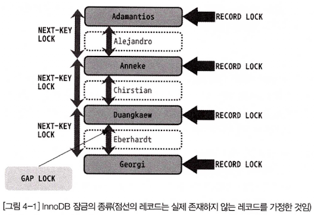
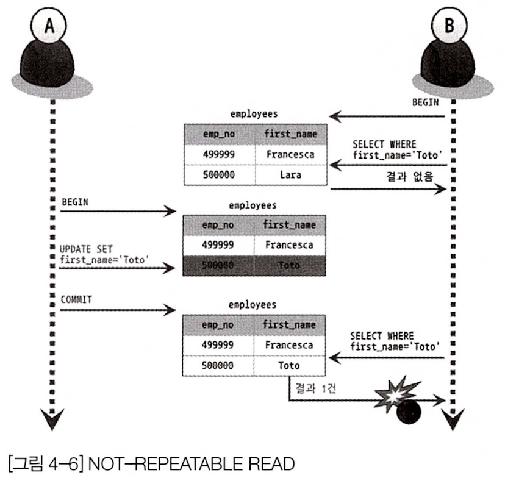
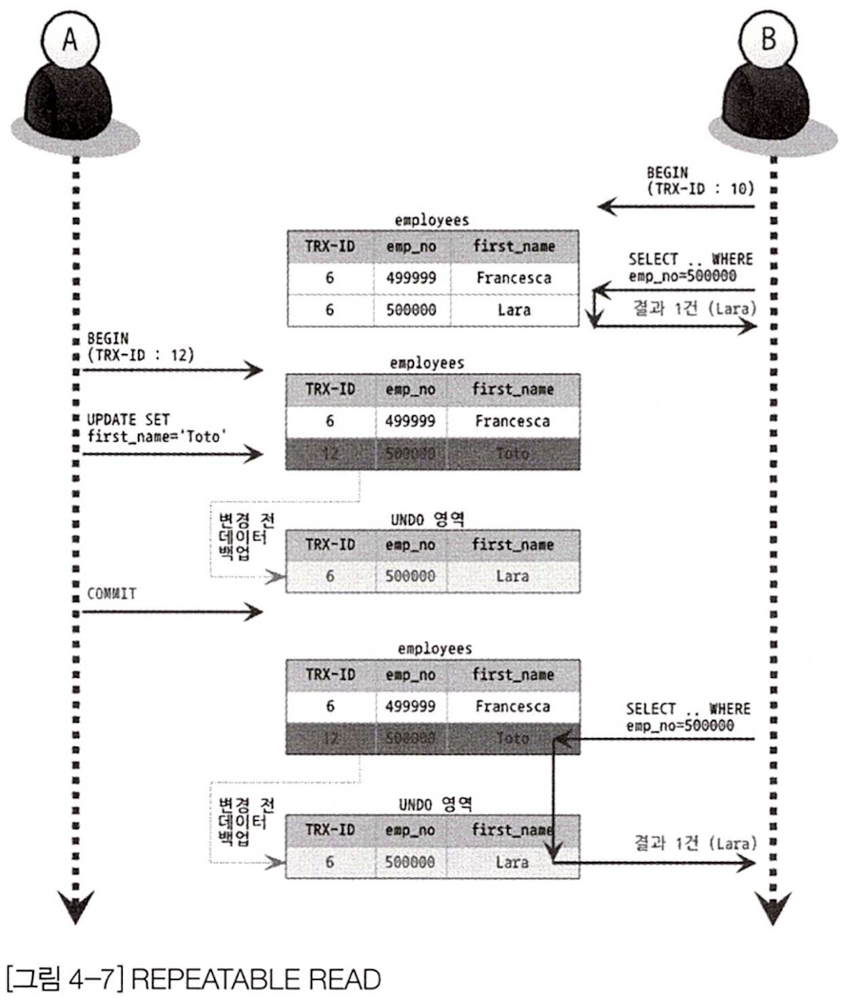
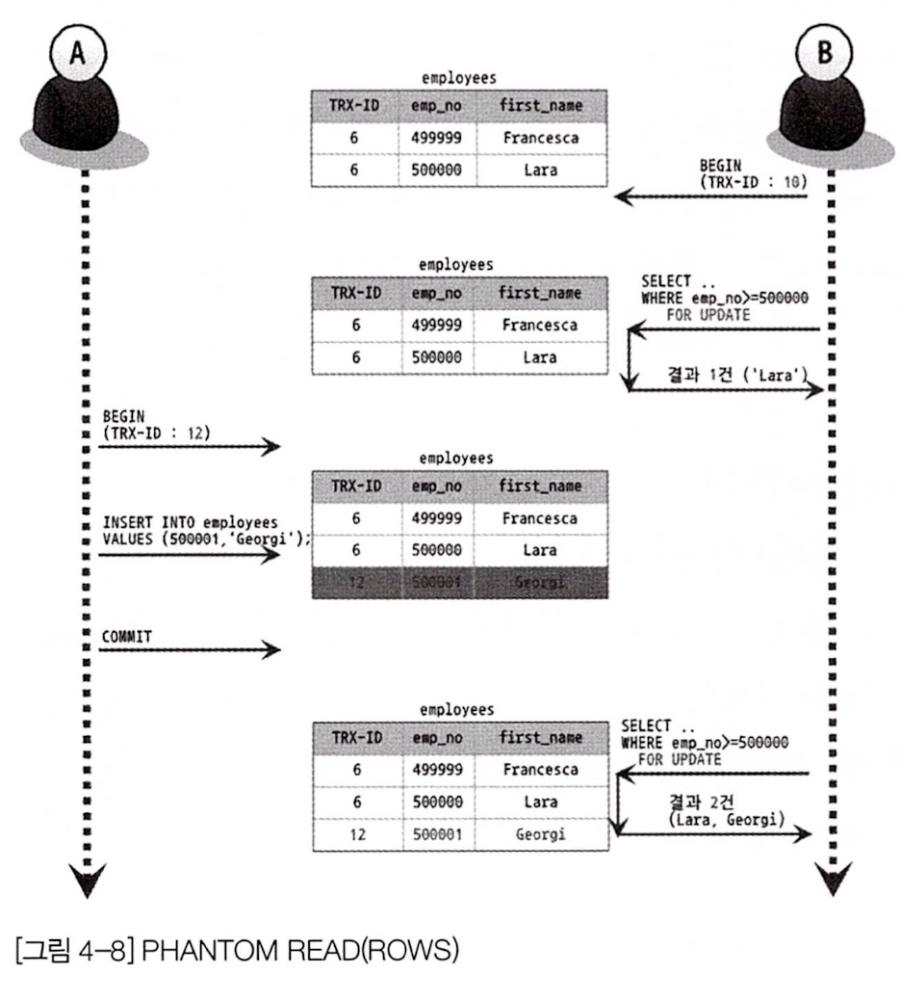

# MySQL 락의 종류

### 글로벌 락
- MySQL 서버 전체에 영향을 미치는 잠금으로, 한 세션에서 글로벌 락을 획득하면 대부분의 DDL 및 DML 쿼리가 대기 상태로 들어간다.
- InnoDB에서는 거의 사용될 일 없고, MyISAM이나 MEMORY 에서 자주 사용한다.

### 테이블 락
- 개별 테이블 단위로 설정되는 잠금으로, MyISAM이나 MEMORY 테이블에서 데이터를 변경하면 묵시적으로 설정된다.
- InnoDB의 경우에는 레코드 기반 잠금을 제공하기 때문에 DML 쿼리에서는 테이블 락의 영향을 안받는게 맞고, DDL에서는 받을 수도 있고 안받을 수도 있다. [Online DDL](https://dev.mysql.com/doc/refman/8.0/en/innodb-online-ddl-operations.html) 참고

### 유저 락
- 사용자가 지정한 문자열에 대한 잠금으로, 트랜잭션 내에 많은 양의 레코드 변경이 있는 경우 활용
- 데드락 방지, 배치 프로세스 등의 대량의 데이터를 최적화하는데 활용

### 네임 락
- 데이터베이스 객체의 이름을 변경할 때 획득하는 잠금. 객체 이름의 일관성 보장에 활용된다.

# InnoDB의 잠금 방식
### 비관적 잠금(Pessimitic locking)
- 현재 트랜잭션에서 변경하고자 하는 레코드에 대해 잠금을 획득하고 변경 작업을 처리하는 방식을 비관적 잠금이라고 한다.

- 일반적으로 높은 동시성 처리에는 비관적 잠금이 유리하다고 알려져 있으며 InnoDB는 비관적 잠금 방식을 사용하고 있다.

### 낙관적 잠금(Optimistic locking)

- 기본적으로 트랜잭션이 같은 레코드를 변경할 가능성은 상당히 희박할 것이라고 가정한다.

- 우선 변경 작업을 수행하고 마지막에 잠금 충돌이 있었는지 확인해 문제가 있었다면 ROLLBACK 처리하는 방식을 의미한다.

# InnoDB의 잠금 종류
- InnoDB 스토리지 엔진은 레코드 기반의 잠금 기능을 제공하며, 잠금 정보가 상당히 작은 공간으로 관리되기 때문에 페이지 락으로 또는 테이블 락으로 레벨업되는 경우(락 에스컬레이션)는 없다.

- InnoDB 스토리지 엔진에서는 레코드 락뿐 아니라 레코드와 레코드 사이의 간격을 잠그는 갭(GAP)락이라는 것이 존재한다.

### 레코드 락(Record lock, Record only lock)

- 레코드 자체만을 잠그는 것을 레코드 락이라 한다.

- InnoDB 스토리 엔진은 레코드 자체가 아니라 인덱스의 레코드를 잠근다. 만약 인덱스가 하나도 없는 테이블이라 하더라도 내부적으로 자동 생성된 클러스터 인덱스를 이용해 잠금을 설정한다.

- InnoDB에서는 대부분 보조 인덱스를 이용한 변경 작업은 이어서 설명한 넥스트 키 락(Next key lock) 또는 갭 락(Gap lock)을 사용하지만, 프라이머리 키 또는 유니크 인덱스에 의한 변경 작업은 갭(Gap)에 대해서는 잠그지 않고 레코드 자체에 대해서만 락을 건다.

### 갭 락(Gap lock)

- 갭 락은 레코드 그 자체가 아니라 레코드와 바로 인접한 레코드 사이의 간격만을 잠그는 것을 의미한다.

- 갭 락의 역할은 레코드와 레코드 사이의 간격에 새로운 레코드가 생성(INSERT)되는 것을 제어하는 것이다.

- 갭 락이라는 것은 개념일 뿐이지 자체적으로 사용되지는 않고, 이어서 설명할 넥스트 키 락의 일부로 사용된다.

### 넥스트 키 락(Next key lock)

- 레코드 락과 갭 락을 합쳐 놓은 형태의 잠금을 넥스트 키 락이라 한다.

- InnoDB의 갭 락이나 넥스트 키 락은 바이너리 로그에 기록되는 쿼리가 슬레이브에서 실행될 때 마스터에서 만들어낸 결과와 동일한 결과를 만들어내도록 보장해주는 것이 목적이다.

### 자동 증가 락(Auto increment lock)

- MySQL에서는 자동 증가하는 숫자 값을 추출(채번)하기 위해 AUTO_INCREMENT라는 컬럼 속성을 제공한다.

여러 레코드가 INSERT 되는 경우, 저장되는 각 레코드는 중복되지 않고 저장된 순서대로 증가한 일련번호를 가져야 한다.

- InnoDB 스토리지 엔진에서는 이를 위해 내부적으로 AUTO_INCREMENT 락이라고 하는 테이블 수준의 잠금을 사용한다.

- INSERT와 REPLACE 쿼리 문장과 같이 새로운 레코드를 저장하는 쿼리에만 필요하다.

- 트랜잭션과 관계없이 INSERT와 REPLACE 문장에서 AUTO_INCREMENT 값을 가져오는 순간만 AUTO_INCREMENT 락이 걸렸다가 즉시 해제된다.

- 테이블에서 단 하나만 존재하기 때문에 두 개의 INSERT 쿼리가 동시에 실행되는 경우 하나의 쿼리가 AUTO_INCREMENT 락을 걸게되면 나머지 쿼리는 AUTO_INCREMENT 락을 기다려야 한다.

### 인덱스와 잠금
- InnoDB의 잠금은 레코드를 잠그는 것이 아니라 인덱스를 잠그는 방식으로 처리된다. 즉,변경해야 할 레코드를 찾기 위해 검색한 인덱스의 레코드를 모두 잠가야 한다.

- 적절히 인덱스가 준비돼 있지 않다면 각 클라이언트 간의 동시성이 상당히 떨어질 수 있다.

### 트랜잭션 격리 수준과 잠금
- 불필요한 레코드의 잠금 현상은 InnoDB의 넥스트 키 락 때문에 발생하는 것이다.

- InnoDB에서 넥스트 키 락을 필요하게 만드는 주 원인은 복제를 위한 바이너리 로그 때문이다.

- 아직 많이 사용되지는 않지만 레코드 기반의 바이너리 로그(Row based binary log)를 사용하거나 바이너리 로그를 사용하지 않는 경우에는 InnoDB의 갭 락이나 넥스트 키 락의 사용을 대폭 줄일 수 있다.

- InnoDB의 갭 락이나 넥스트 키 락을 줄일 수 있다는 것은 사용자의 쿼리 요청을 동시에 더 많이 처리할 수 있음을 의미한다.

# MySQL의 격리 수준
트랜잭션의 격리 수준(isolation level)이란 동시에 여러 트랜잭션이 처리될 때, 특정 트랜잭션이 다른 트랜잭션에서 변경하거나 조회하는 데이터를 볼 수 있도록 허용할지 말지를 결정하는 것이다.

- "READ UNCOMMITTED", "READ COMMITTED", "REPEATABLE READ", "SERIALIZABLE" 로 4가지로 나뉜다.

- "DIRTY READ" 라고도 하는 "READ UNCOMMITTED"는 일반적인 데이터베이스에서 거의 사용하지 않는다.

- "SERIALIZABLE" 또한 동시성이 중요한 데이터베이스에서는 거의 사용하지 않는다.

격리 수준이 높아질 수록 MySQL 서버의 처리 성능이 많이 떨어질 것으로 생각하는 사용자가 많다. 하지만 사실 "SERIALIZABLE" 격리 수준이 아니라면 크게 성능의 개선이나 저하는 발생하지 않는다.

### READ UNCOMMITTED
각 트랜잭션에서의 변경 내용이 COMMIT이나 ROLLBACK 여부에 상관 없이 다른 트랜잭션에서 보여진다.

어떤 트랜잭션에서 처리한 작업이 완료되지 않았는데도 다른 트랜잭션에서 볼 수 있게 되는 현상을 "DIRITY READ"라 하고, "DIRITY READ"가 허용되는 격리 수준이 "READ UNCOMMITTED" 이다.

### READ COMMITTED
보통 온라인 서비스에서 가장 많이 사용하는 격리수준이다.

"DIRTY READ"와 같은 현상은 발생하지 않는다.

어떤 트랜잭션에서 데이터를 변경했더라도 COMMIT이 완료된 데이터만 다른 트랜잭션에서 조회할 수 있기 때문이다.(Undo 에서 백업한걸 보여주다가 COMMIT 되면 변경된것을 보여줌)

"NON-REPEATABLE READ"라는 부정합 문제가 있다.

그림 4.6에서 처음 사용자 B가 BEGIN 명령으로 트랜잭션을 시작하고 first_name이 'Toto%'인 사용자를 검색했는데, 일치하는 사람이 없다.
1. 사용자 A가 사원번호 500000인 사원의 이름을 'Toto'로 변경하고 커밋을 실행한 이후
2. 사용자 B가 다시 1번의 SELECT 쿼리로 조회하면 결과가 1건 나온다.
3. 사용자 B가 하나의 트랜잭션 내에서 똑같은 SELECT 쿼리를 실행했을 때 항상 같은 결과를 가져와야 되는 "REPEATABLE READ" 정합성에 어긋나는 것이다.

###  REPEATABLE READ
MySQL의 InnoDB 스토리 엔진에서 기본적으로 사용되는 격리 수준이다.

- 바이너리 로그를 가진 MySQL의 장비에서는 최소 REPEATABLE READ 격리 수준 이상을 사용해야 한다.

"NON-REPEATABLE READ"라는 부정합 문제가 발생하지 않는다.

InnoDB 스토리지 엔진은 트랜잭션이 ROLLBACK 될 가능성을 대비해 변경되기 전 레코드를 언두(Undo) 공간에 백업해두고 실제 레코드 값을 변경한다. 이러한 변경 방식을 MVVC(Multi Version Concurrency Control)이라 한다.

Undo 영역에 백업된 데이터는 InnoDB 스토리지 엔진이 불필요하다고 판단하는 시점에 주기적으로 삭제한다.

REPETABLE READ 격리 수준에서는 MVCC를 보장하기 위해 실행 중인 트랜잭션 가운데 가장 오래된 트랜잭션 번호보다 앞선 Undo 영역의 데이터는 삭제할 수가 없다.

하지만 REPERTABLE READ 격리 수준에서도 아래와 같은 부정합이 발생 할 수 있다.

위 4-8 그림은 사용자 A가 employees 테이블에 INSERT를 실행하는 도중에 사용자 B가 SELECT .. FOR UPDATE 쿼리로 employees 테이블을 조회했을 때 어떤 결과를 보여주는지 알 수 있다.

위와 같이 다른 트랜잭션에서 수행한 변경 작업에 의해 레코드가 보였다가 안보였다가 하는 현상을 PHANTOM READ(또는 PHANTOM ROW)라고 한다.

SELECT .. FOR UPDATE 쿼리는 SELECT 하는 레코드에 쓰기 잠금을 걸어야 하는데, Undo 레코드에는 잠금을 걸 수 없다.

즉, SELECT .. FOR UPDATE 나 SELECT .. LOCK IN SHARE MODE 로 조회되는 레코드는 Undo 영역의 변경 전 데이터를 가져오는 것이 아니라 실제 데이터를 가져오게 되는 것이다.

### SERIALIZABLE
가장 단순하지만 가장 엄격한 격리 수준이다. 동시 처리 성능도 다른 트랜잭션 격리 수준보다 떨어진다.

InnoDB 테이블에서 기본적으로 순수한 SELECT 작업(INSERT ... SELECT ... 또는 CREATE TABLE ... AS SELECT ... 가 아닌)은 아무런 레코드 잠금도 설정하지 않지만 SERIALIZABLE 로 설정되면 읽기 작업도 공유 잠금(읽기 잠금)을 획득해야만 하며, 동시에 다른 트랜잭션은 그러한 레코드를 변경하지 못하게 된다.

즉, 한 트랜잭션에서 읽고 쓰는 레코드를 다른 트랜잭션에서는 절대 접근할 수 없는 것이다.

